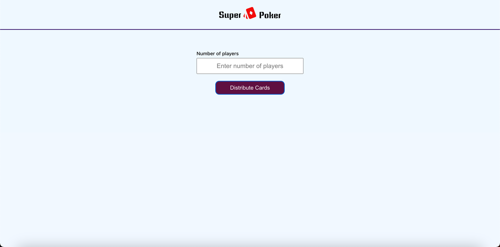
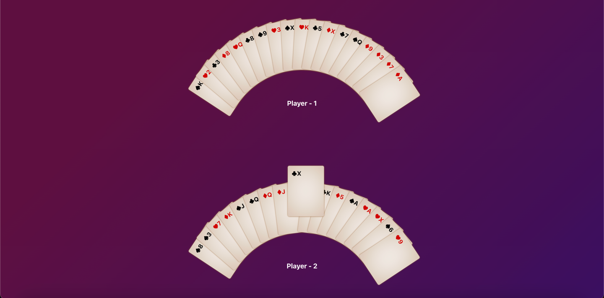

<br />

<h3 align="center">Playing Cards Distribution - React</h3>

#### Technologies Used

- [React.js](https://facebook.github.io/react/)
- [JavaScript](https://www.javascript.com/)
- [SCSS](https://sass-lang.com/)
- [yarn](https://yarnpkg.com/)

#### First Installation

1. Clone from Github fork repo.

```sh
git clone https://github.com/mdashiq2592/super-poker.git
```

2. Install dependencies using `yarn`

```sh
yarn install
```

## Usage

After that, simply run below command to start up the development server

```sh
yarn start
```

Open [http://localhost:3000](http://localhost:3000) with your browser to see the result.


## Time Taken to build the project

10 hours

## Deployment

Deployed the application using vercel

## Screenshots


